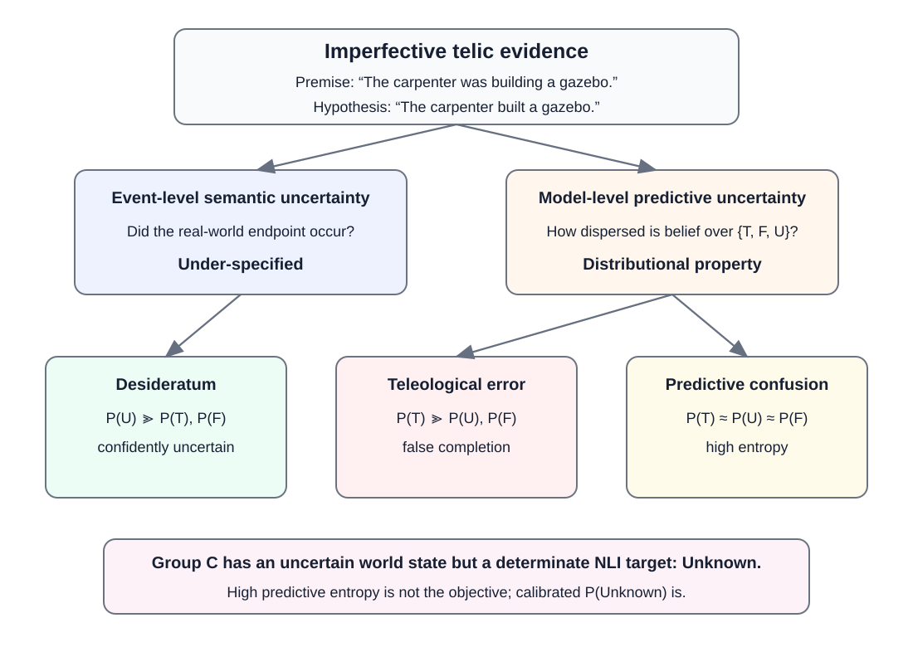
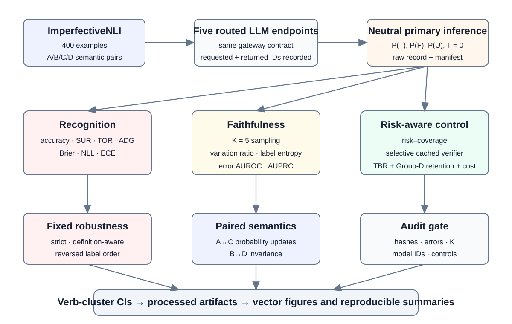

# ULLM — The Imperfective Uncertainty in Large Language Models

[](https://github.com/Rocky5502/ULLM/actions/workflows/ci.yml)
[](LICENSE)

ULLM is a reproducible black-box evaluation framework for studying **semantic uncertainty**, **predictive uncertainty**, and **uncertainty-aware control** in large language models.

The central question is simple: when the underlying world state is genuinely under-specified, does a model represent that uncertainty correctly, do its uncertainty signals track its own failures, and can those signals support safer decisions?

## Why this matters

A model can be uncertain for very different reasons. In the critical imperfective telic setting, the event outcome may be unknown while the correct NLI relation is determinately **Unknown**. A reliable model should therefore assign high probability to the `Unknown` relation. Diffuse probabilities alone are not sufficient: high predictive entropy can reflect confusion rather than correct semantic uncertainty.

<p align="center">
  
</p>

<p align="center"><em>Figure 1. Semantic uncertainty and predictive uncertainty are different objects. Correct behavior is calibrated confidence in the <code>Unknown</code> relation, not indiscriminate distributional uncertainty.</em></p>

## What ULLM evaluates

ULLM organizes the study around three reliability questions:

- **Recognition:** whether routed LLM endpoints distinguish semantic under-specification from determinate entailment or contradiction.
- **Faithfulness:** whether verbalized probability uncertainty and repeated-sampling disagreement identify actual model failures.
- **Control:** whether uncertainty can support selective defer/recheck policies without unnecessarily degrading valid predictions.

The frozen study uses the 400-example ImperfectiveNLI benchmark, a neutral primary prompt, deterministic structured `P(True)`, `P(False)`, `P(Unknown)` predictions, `K=5` repeated sampling, fixed prompt/order robustness conditions, and an independently cached verifier.

<p align="center">
  
</p>

<p align="center"><em>Figure 2. Audited black-box evaluation pipeline. Request metadata, manifests, model identifiers, controls, and audit evidence are preserved before aggregate analyses are produced.</em></p>

## Core capabilities

- five-family routed model panel with requested/returned model identifiers recorded per response;
- immutable benchmark provenance and validation;
- deterministic and repeated-sampling uncertainty analysis;
- calibration, Brier/NLL, entropy, variation-ratio, AUROC/AUPRC, AURC/E-AURC, paired semantic and risk-coverage metrics;
- fixed robustness conditions and label-order controls;
- selective cached-verifier analysis;
- verb-cluster bootstrap confidence intervals and Holm correction;
- resume-safe execution, checksums, completion-budget auditing, model-control auditing, and decision/distribution consistency diagnostics;
- zero-API synthetic and full request-plan rehearsals for reproducibility testing.

## Frozen routed model panel

| Family | Gateway routing ID |
|---|---|
| OpenAI | `gpt-5.6-sol` |
| Anthropic | `claude-sonnet-5` |
| DeepSeek | `deepseek-v4-pro` |
| Alibaba–Qwen | `qwen3.8-max` |
| Google | `gemini-3.7-flash` |

These strings are recorded **gateway routing identifiers**, not claims about immutable vendor-direct checkpoints. Live runs record both the requested and returned model IDs so scientific conclusions remain tied to the observed routed endpoints.

## Repository layout

```text
ULLM/
├── assets/      README research figures
├── configs/     Frozen experiment and model configuration
├── data/        Provenance metadata and benchmark fetch/validation tools
├── docs/        Protocol, analysis, artifact, and reproducibility documentation
├── results/     Local output locations; raw/processed empirical artifacts are ignored
├── scripts/     Execution, auditing, statistics, figure/table, and packaging utilities
├── src/ullm/    Core client, prompts, parsing, metrics, statistics, and runner
└── tests/       Unit and provenance/audit tests
```

The manuscript source is intentionally maintained outside this public code artifact.

## Quick start

Python 3.10–3.12 is supported; the frozen reference environment uses Python 3.11.

```bash
python -m venv .venv
# Windows: .venv\Scripts\activate
# Linux/macOS: source .venv/bin/activate
python -m pip install --upgrade pip
pip install -r requirements.txt
```

Fetch and validate the benchmark from its pinned upstream revision:

```bash
python scripts/fetch_imperfective_nli.py
python scripts/validate_dataset.py data/imperfectiveNLI.json
python scripts/preflight.py
```

Run the zero-API validation stack:

```bash
python scripts/validate_project.py
python scripts/offline_rehearsal.py
python scripts/synthetic_pipeline_smoke.py
pytest -q
```

The complete offline rehearsal constructs and audits the planned 15,800-request main-study matrix without creating an API client.

## Live execution and credentials

Live execution is deliberately opt-in. Credentials are read only from the local environment; no credential value is written into manifests, environment snapshots, or committed files.

- Never commit a populated `.env` file.
- Never place API keys in configs, scripts, notebooks, issues, or result files.
- `.env.example` contains placeholders only.
- Raw provider responses and local execution evidence are excluded from version control by default.

Before sharing a checkout, run:

```bash
python scripts/security_scan.py
```

## Data and publication boundary

The ImperfectiveNLI benchmark is third-party research data and is **not redistributed** in this repository. `data/MANIFEST.json` records the pinned upstream source and expected artifact properties; the downloader retrieves that exact source locally. Third-party data remain subject to their original terms.

Raw API responses, processed empirical outputs, local environment snapshots, credentials, downloaded benchmark bytes, and other machine-local evidence are excluded from Git by default. The released repository contains the code, configuration, provenance metadata, tests, and documentation needed to reproduce the workflow without exposing private execution material.

## Reproducibility and auditing

The runner supports a dry-run mode that materializes exact request plans without constructing an API client. Live runs preserve run manifests and request metadata, and downstream analysis is gated by checks for record coverage, parse/request failures, completion-budget exhaustion, model-specific controls, checksums, and label/probability consistency.

See:

- [`docs/EXPERIMENT_PROTOCOL.md`](docs/EXPERIMENT_PROTOCOL.md)
- [`docs/ANALYSIS_PLAN.md`](docs/ANALYSIS_PLAN.md)
- [`docs/REPRODUCIBILITY.md`](docs/REPRODUCIBILITY.md)
- [`docs/CONTRACT_ADJUDICATION_A1.md`](docs/CONTRACT_ADJUDICATION_A1.md)
- [`docs/ARTIFACT_GUIDE.md`](docs/ARTIFACT_GUIDE.md)

## Research foundation

The controlled semantic testbed derives from **The Imperfective Paradox in Large Language Models**, which introduced the ImperfectiveNLI evaluation setting. ULLM uses that semantic foundation to study a distinct reliability problem: separating correct semantic uncertainty from predictive confusion and evaluating whether black-box uncertainty signals can support risk-aware control.

When using the benchmark, please also cite its original paper/release according to the upstream terms.

## Citation

Repository citation metadata are provided in [`CITATION.cff`](CITATION.cff). Please cite the archival ULLM paper when available and cite the upstream ImperfectiveNLI work when using the benchmark.

## License

Original ULLM software and documentation are released under the [MIT License](LICENSE). The license does not relicense third-party benchmark data or other upstream resources.
